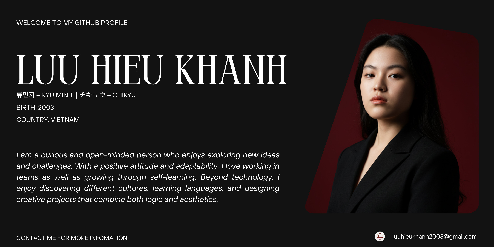

<!-- Header Banner -->

  

<h1 align="center">Hi 👋, I'm Luu Hieu Khánh</h1>
<h3 align="center">류민지 – Ryu Min Ji | チキュウ – Chikyu</h3>
<h4 align="center">
  
</h4>

---

## 📫 Connect with Me  

  

---

## 🚀 Skills & Tools  

### 🔹 Programming Languages  

  

### 🔹 Front-End  

  

### 🔹 Back-End  

  

### 🔹 Database  

  

### 🔹 Currently Learning  

  

---

## 🎨 Fun Extras  

### ✨ Profile Views  

  

---

⭐ *Thanks for visiting my profile! Let's connect and build something amazing together 🚀*
